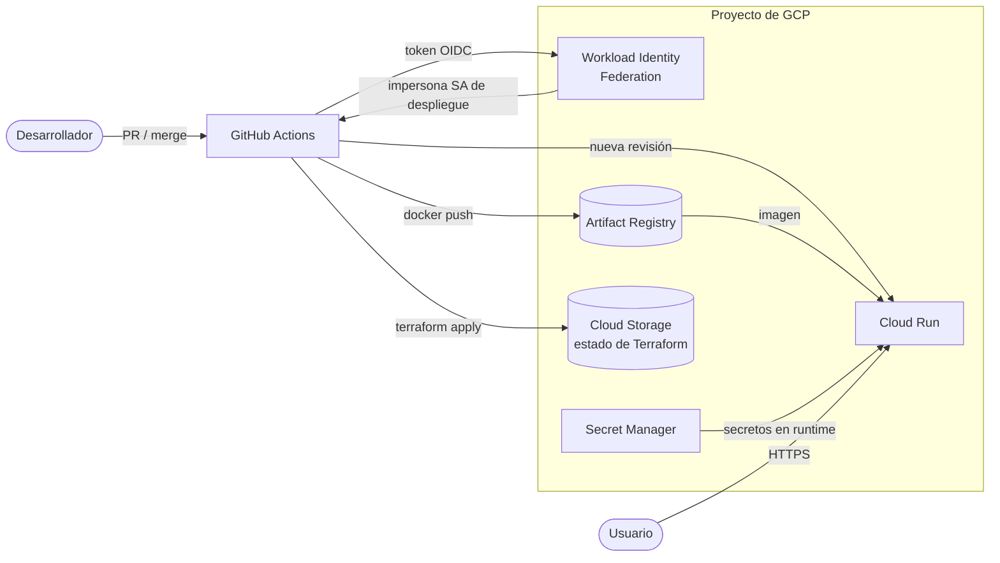

# dockyard2sail-gcp


Template de infraestructura como código para desplegar una API en **Google Cloud Run** con Terraform, sin llaves de servicio y con CI/CD desde GitHub Actions. Es el hermano de infraestructura de [`dockyard2sail-py`](https://github.com/cuauhtemocbe/dockyard2sail-py) y [`dockyard2sail-ts`](https://github.com/cuauhtemocbe/dockyard2sail-ts): esos dos resuelven "cómo arranco el código", este resuelve "cómo lo llevo a producción en GCP".

> **Estado: en construcción.** Existe el módulo [`terraform/bootstrap/`](terraform/bootstrap/README.md) (estado remoto, Workload Identity Federation y service accounts de CI), verificado en un proyecto real. El resto sigue en diseño: no hay más módulos, entornos ni workflows de despliegue. Las secciones marcadas como *planeado* se irán convirtiendo en realidad y este documento se actualizará con ellas.

## Problema

Desplegar un contenedor en GCP por primera vez suele terminar en clics en la consola, una llave JSON de service account pegada en los secrets de GitHub y un entorno que nadie sabe reconstruir. Este template propone el camino opuesto: todo declarado en Terraform, ninguna credencial de larga vida y un entorno reproducible con un solo `terraform apply`.

## Alcance

**Incluye** (estado remoto, Workload Identity Federation y las service accounts de CI ya existen en `terraform/bootstrap/`; lo demás es planeado):

- **Cloud Run** como destino del contenedor, con servicio, revisiones y tráfico definidos en Terraform.
- **Artifact Registry** para las imágenes, con política de limpieza de versiones antiguas.
- **Secret Manager** para la configuración sensible, montada en el servicio como variables de entorno.
- **Workload Identity Federation** para que GitHub Actions se autentique en GCP sin llaves JSON.
- **Service accounts de mínimo privilegio**, separadas para el despliegue (CI) y para la ejecución (runtime).
- **Estado remoto** de Terraform en Cloud Storage, con versionado activado.
- **Dos entornos** (`dev` y `prod`) que reutilizan los mismos módulos.
- **Presupuesto con alerta** para que un error de configuración no se convierta en una factura.
- **Pipeline de GitHub Actions**: `terraform fmt`/`validate`/`plan` en cada PR, y build + push + deploy al hacer merge a `main`.

**No incluye (por ahora):**

- Redes privadas (VPC, Serverless VPC Access) ni bases de datos gestionadas: se agregarán como módulos opcionales si el template lo pide.
- Multi-región ni balanceador global.
- Código de aplicación propio: el ejemplo de despliegue usa la imagen de `dockyard2sail-py`.

## Arquitectura prevista



La autenticación no guarda ningún secreto en GitHub: el workflow presenta un token OIDC efímero, Workload Identity Federation lo valida contra el repositorio autorizado y entrega credenciales de corta vida para impersonar la service account de despliegue.

## Estructura prevista

Hoy existe solo `terraform/bootstrap/`; el resto es planeado.

```
.
├── terraform/
│   ├── bootstrap/          # Ya existe. Se corre una vez: bucket de estado, WIF, service accounts de CI
│   ├── modules/
│   │   ├── cloud-run-service/
│   │   ├── artifact-registry/
│   │   ├── secrets/
│   │   └── budget-alert/
│   └── envs/
│       ├── dev/
│       └── prod/
├── .github/workflows/      # plan en PR, deploy en main
├── docs/                   # decisiones (ADRs) y guía de arranque
├── Makefile                # fmt, validate, plan, apply por entorno
└── README.md
```

## Decisiones de diseño

| Decisión | Alternativa descartada | Por qué |
|----------|------------------------|---------|
| Workload Identity Federation | Llave JSON de service account en secrets de GitHub | Una llave filtrada da acceso indefinido; un token OIDC expira en minutos y solo sirve para un repo y una rama concretos. |
| Cloud Run | GKE, Compute Engine | Para una API contenedorizada no hace falta administrar nodos, y escala a cero cuando no hay tráfico. |
| Terraform | Consola, `gcloud` en scripts | El entorno se puede reconstruir, revisar en un PR y comparar con `plan` antes de aplicarlo. |
| Módulos + carpetas por entorno | Workspaces de Terraform | Un `dev` y un `prod` que pueden divergir de forma explícita y visible en el diff, sin depender de una variable de workspace. |
| Service accounts separadas (CI vs runtime) | Una sola cuenta con permisos amplios | Si la API se compromete, no puede modificar infraestructura. |

Cada decisión con matices se documentará como ADR en `docs/`.

## Costos

Pensado para caber en el nivel gratuito de Google Cloud en un proyecto de bajo tráfico. Cloud Run incluye un cupo mensual gratuito de solicitudes, y Artifact Registry, Secret Manager y Cloud Storage cobran poco o nada a esta escala. Los límites exactos cambian con el tiempo: consulta [cloud.google.com/free](https://cloud.google.com/free) antes de desplegar. El módulo `budget-alert`, todavía planeado, existirá para avisar si algo se sale del plan.

## Requisitos previos

Para `terraform/bootstrap/` (los prerrequisitos completos están en [su README](terraform/bootstrap/README.md)):

- Una cuenta de Google Cloud con facturación habilitada (el nivel gratuito la exige).
- Un proyecto de GCP por entorno.
- Docker y `gcloud` instalados. Terraform corre dentro de Docker vía `make`, no se instala.
- Un repositorio de GitHub con Actions habilitado.

## Cómo usarlo

El paso 1 ya funciona. Los pasos 2 y 3 son planeados.

```bash
# 1. Crear el estado remoto y la federación de identidad (una sola vez)
#    Procedimiento completo: terraform/bootstrap/README.md
make bootstrap PROJECT_ID=mi-proyecto-dev
make bootstrap-migrate PROJECT_ID=mi-proyecto-dev

# 2. Planear y aplicar un entorno (planeado)
make plan  ENV=dev
make apply ENV=dev

# 3. A partir de aquí, cada merge a main despliega vía GitHub Actions (planeado)
```

## Hoja de ruta

- [x] Módulo `bootstrap` (estado remoto + Workload Identity Federation).
- [ ] Módulo `cloud-run-service` con el ejemplo de `dockyard2sail-py`
- [ ] Módulos `artifact-registry` y `secrets`
- [ ] Workflow de `plan` en PR y `deploy` en `main`
- [ ] Entornos `dev` y `prod`
- [ ] Módulo `budget-alert`
- [x] Escaneo de la infraestructura con Trivy (misconfiguraciones de IaC) en CI
- [ ] Guía de arranque y ADRs en `docs/`

## Desarrollo

El tooling y la validación cubren `terraform/bootstrap/`. Todo corre dentro de Docker vía `make` (`make help` lista los targets):

```bash
make validate       # fmt-check + terraform validate + license-check
make secrets-scan   # gitleaks sobre el diff staged
make secrets-history # gitleaks sobre todo el historial de git
make trivy          # vulnerabilidades y misconfiguraciones de IaC (requiere trivy en el PATH)
make install-hooks  # habilitar los git hooks (una vez por clon)
```

- **Hooks** (`.githooks/`, habilitados con `make install-hooks`): el `pre-commit` corre `make validate` y un escaneo de secretos con [gitleaks](https://github.com/gitleaks/gitleaks) sobre el diff staged; el `pre-push` corre Trivy y bloquea solo si hay un hallazgo CRITICAL con fix publicado. El `pre-push` requiere el binario [`trivy`](https://github.com/aquasecurity/trivy) en el `PATH` y falla cerrado si no está.
- **CI** (`.github/workflows/ci.yml`): jobs paralelos `fmt`, `validate`, `license-check`, `trivy-fs` y `gitleaks` (este último sobre todo el historial). Las Actions de terceros están pineadas por commit SHA y el workflow declara `permissions: contents: read`.
- **Sin `lock-check` ni job de build por ahora**: el lockfile de providers (`terraform/bootstrap/.terraform.lock.hcl`) ya existe y falta el job que lo verifique; este template no construye imágenes, así que no hay job de build.
- **Imágenes de herramientas fijadas por digest** en el `Makefile`. Se actualizan a mano (Dependabot no las ve ahí).

Las reglas para agentes y el checklist previo a un merge están en [`CLAUDE.md`](./CLAUDE.md). El historial de cambios, en [`CHANGELOG.md`](./CHANGELOG.md). Los estándares que sigue este repo viven en `meta-projects/docs/development-standards.md`.

## Licencia

[MIT](./LICENSE)
